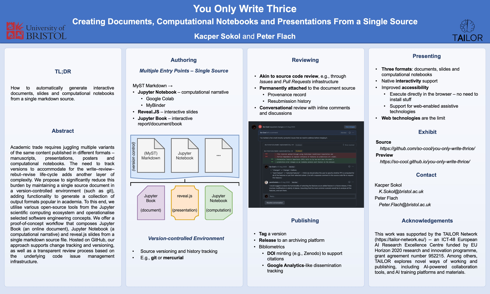

(yowt)=
# You Only Write Thrice #
<h1>Creating Documents, Computational Notebooks
    and Presentations From a Single Source
</h1>

```{admonition} TL;DR
:class: warning
How to automatically generate interactive documents, slides and computational
notebooks from a single markdown source.
```

```{admonition} Authors
:class: tip
**Kacper Sokol** *and* **Peter Flach**  
{[K.Sokol](mailto:K.Sokol@bristol.ac.uk),
[Peter.Flach](mailto:Peter.Flach@bristol.ac.uk)}@bristol.ac.uk

Department of Computer Science,  
University of Bristol,  
Bristol, United Kingdom
```

```{admonition} Venue
:class: note
This [Jupyter Book] article is an exhibit accompanying the
["You Only Write Thrice"][openreview] paper published at
[Rethinking ML Papers][workshop] -- [ICLR 2021 Workshop][iclr]
([{fa}`twitter,style=fab`][twitter]).
```

(abstract)=
## Abstract ##
> Academic trade requires juggling multiple variants of the same content
  published in different formats: manuscripts, presentations, posters
  and computational notebooks. The need to track versions to accommodate
  for the write--review--rebut--revise life-cycle adds another layer of
  complexity. We propose to significantly reduce this burden by
  maintaining a single source document in a version-controlled
  environment (such as `git`), adding functionality to generate a
  collection of output formats popular in academia. To this end, we
  utilise various open-source tools from the Jupyter scientific
  computing ecosystem and operationalise selected software engineering
  concepts. We offer a proof-of-concept workflow that composes Jupyter
  Book (an online document), Jupyter Notebook (a computational
  narrative) and reveal.js slides from a single markdown source file.
  Hosted on GitHub, our approach supports change tracking and
  versioning, as well as a transparent review process based on the
  underlying code issue management infrastructure. An exhibit of our
  workflow can be previewed at
  <https://so-cool.github.io/you-only-write-thrice/>.

## Static Document ##

In addition to this online document, the paper can be downloaded as a PDF
either from [OpenReview] or [arXiv].
The source of this article is available on [GitHub][source].

<a class="btn btn-outline-primary"
   href="https://openreview.net/forum?id=i4zpuNRiU4G">{fa}`file-pdf,style=fas` OpenReview (PDF)</a>
<a class="btn btn-outline-primary"
   href="https://arxiv.org/abs/2107.06639">{fa}`file-pdf,style=fas` arXiv (PDF)</a>
<a class="btn btn-outline-primary"
   href="https://github.com/so-cool/you-only-write-thrice">{fa}`book,style=fas` GitHub (Jupyter Book)</a>

## Review ##

This paper has been reviewed on [OpenReview].

<a class="btn btn-outline-success"
   href="https://openreview.net/forum?id=i4zpuNRiU4G">{fa}`vote-yea,style=fas` OpenReview</a>

## Promotional Video ##

<div style="position: relative; width: 100%; height: 0; padding-bottom: 56.25%;">
<!--width="560" height="315"-->
<iframe style="position: absolute; top: 0; left: 0; width: 100%; height: 100%;"
        src="https://www.youtube.com/embed/h9rL5QPBBs4"
        title="You Only Write Thrice – Promotional Video (ICLR 2021 Rethinking ML Papers Workshop)"
        frameborder="0"
        allow="accelerometer; autoplay; clipboard-write; encrypted-media; gyroscope; picture-in-picture"
        allowfullscreen>
</iframe>
</div>
<br>

<a class="btn btn-outline-danger"
   href="https://www.youtube.com/watch?v=h9rL5QPBBs4">{fa}`youtube,style=fab` Promotional Video (YouTube)</a>

## Oral Presentation ##

The oral presentation is available on [SlidesLive][oral-sl] (starting at
*4:14:00*) via the recording of the workshop, with the video embedded below.
Alternatively, you can view the talk on [YouTube][oral-yt].
The slides used for the presentation are published as
[part of this online document](sec:slides).

### Slides ###

{numref}`Section %s <sec:slides>`: {ref}`sec:slides` renders the slides
as an article page.
To view this content as a *static* ([reveal.js]) or an *interactive*
([reveal.js] and [RISE]; launched via Jupyter Notebook delivered through
MyBinder) presentation use these buttons.

<a class="btn btn-outline-primary"
   href="https://so-cool.github.io/you-only-write-thrice/src/slides/yowt_slides.slides.html">{fa}`tv,style=fas` <b>Static</b> Slides</a>
<a class="btn btn-outline-primary"
    href="https://mybinder.org/v2/gh/so-cool/you-only-write-thrice/master?urlpath=tree/src/slides/yowt_slides.md">{fa}`sync-alt,style=fas` <b>Interactive</b> Slides</a>

:::{note}
More instructions on how to launch the slides are available in
{numref}`Section %s <sec:slides>`.
:::

### SlidesLive ###

<!-- SlidesLive -->
<div id="presentation-embed-38956531"></div>
<script src='https://slideslive.com/embed_presentation.js'></script>
<script>
    embed = new SlidesLiveEmbed('presentation-embed-38956531', {
        presentationId: '38956531',
        autoPlay: false,
        verticalEnabled: true,
        hideTitle: true,
        allowHiddenControlsWhenPaused: true,
        startTime: 15240  // 4:14:00
    });
</script>
<br>

<a class="btn btn-outline-danger"
   href="https://slideslive.com/38956531">{fa}`chalkboard-teacher,style=fas` Workshop Presentation (SlidesLive)</a>

### YouTube ###

<div style="position: relative; width: 100%; height: 0; padding-bottom: 56.25%;">
<!--width="560" height="315"-->
<iframe style="position: absolute; top: 0; left: 0; width: 100%; height: 100%;"
        src="https://www.youtube.com/embed/GMN4TmFRwl4"
        title="You Only Write Thrice @ Rethinking ML Papers – ICLR 2021 Workshop"
        frameborder="0"
        allow="accelerometer; autoplay; clipboard-write; encrypted-media; gyroscope; picture-in-picture"
        allowfullscreen>
</iframe>
</div>
<br>

<a class="btn btn-outline-danger"
   href="https://www.youtube.com/watch?v=GMN4TmFRwl4f">{fa}`youtube,style=fab` Workshop Presentation (YouTube)</a>

## Poster ##

<a href="poster/yowt_poster.pdf">



</a>

<a class="btn btn-outline-primary"
   href="poster/yowt_poster.pdf">{fa}`file-pdf,style=fas` Poster</a>

## Citation ##

```BibTeX
@inproceedings{sokol2021you,
  title     = {{Y}ou {O}nly {W}rite {T}hrice:
               {C}reating {D}ocuments, {C}omputational {N}otebooks and
               {P}resentations {F}rom a {S}ingle {S}ource},
  author    = {Sokol, Kacper and Flach, Peter},
  booktitle = {{B}eyond static papers:
               {R}ethinking how we share scientific understanding in {ML} --
               {ICLR} 2021 workshop},
  year      = {2021},
  note      = {arXiv preprint arXiv:2107.06639},
  doi       = {10.5281/zenodo.5106062}
}
```

## About ##

:::{seealso}
The [original version][v1] of this exhibit was based on *ProbLog code boxes*.
An iteration of this content is now hosted in the
[simply-logical/problog-book-template] GitHub repository, which is published
at <https://problog-template.simply-logical.space/>.
:::

:::{note}
For more details about installing necessary dependencies and building this
book see the [`README.md`] file included in the [GitHub repository] --
[so-cool/you-only-write-thrice] -- that holds the source of this book.
:::

[Jupyter Book]: https://jupyterbook.org/intro.html
[openreview]: https://openreview.net/forum?id=i4zpuNRiU4G
[arxiv]: https://arxiv.org/abs/2107.06639
[workshop]: https://rethinkingmlpapers.github.io/
[twitter]: https://twitter.com/rethinkmlpapers
[iclr]: https://iclr.cc/virtual/2021/workshop/2142
[source]: https://github.com/so-cool/you-only-write-thrice
[oral-sl]: https://slideslive.com/38956531/beyond-static-papers-rethinking-how-we-share-scientific-understanding-in-ml
[oral-yt]: https://www.youtube.com/watch?v=GMN4TmFRwl4
[so-cool/you-only-write-thrice]: https://github.com/so-cool/you-only-write-thrice
[`README.md`]: https://github.com/so-cool/you-only-write-thrice#readme
[reveal.js]: https://github.com/hakimel/reveal.js/
[RISE]: https://rise.readthedocs.io/en/stable/
[v1]: https://github.com/So-Cool/you-only-write-thrice/releases/tag/v1
[simply-logical/problog-book-template]: https://github.com/simply-logical/problog-book-template
